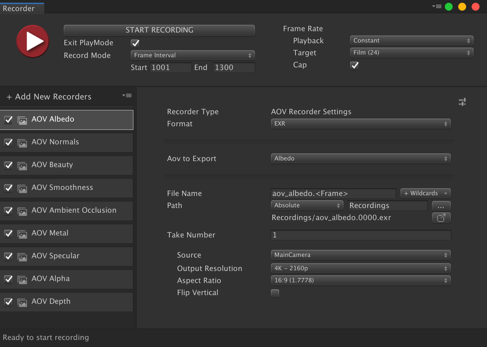
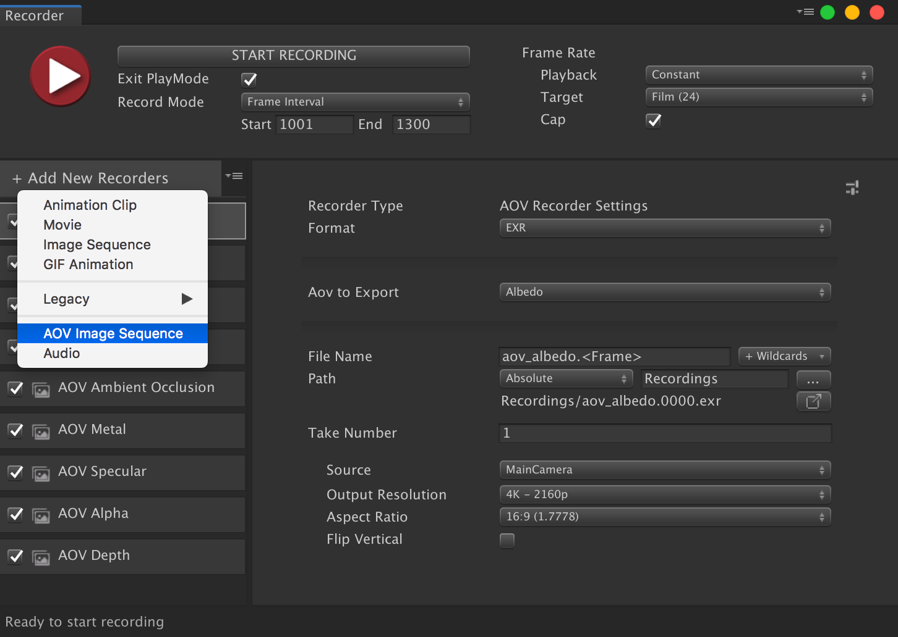
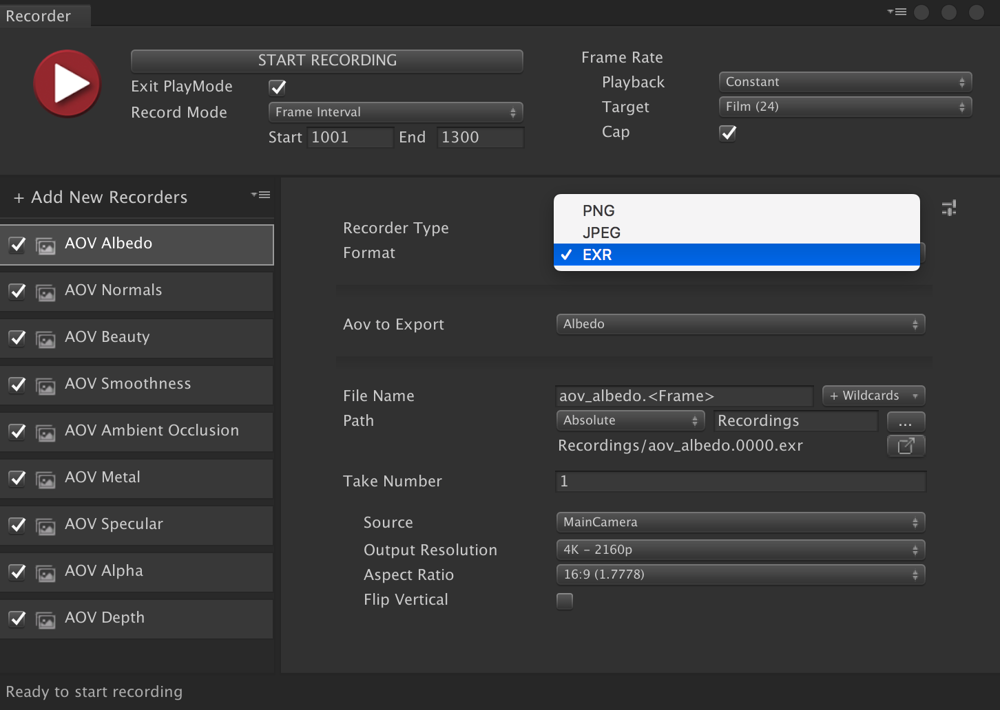
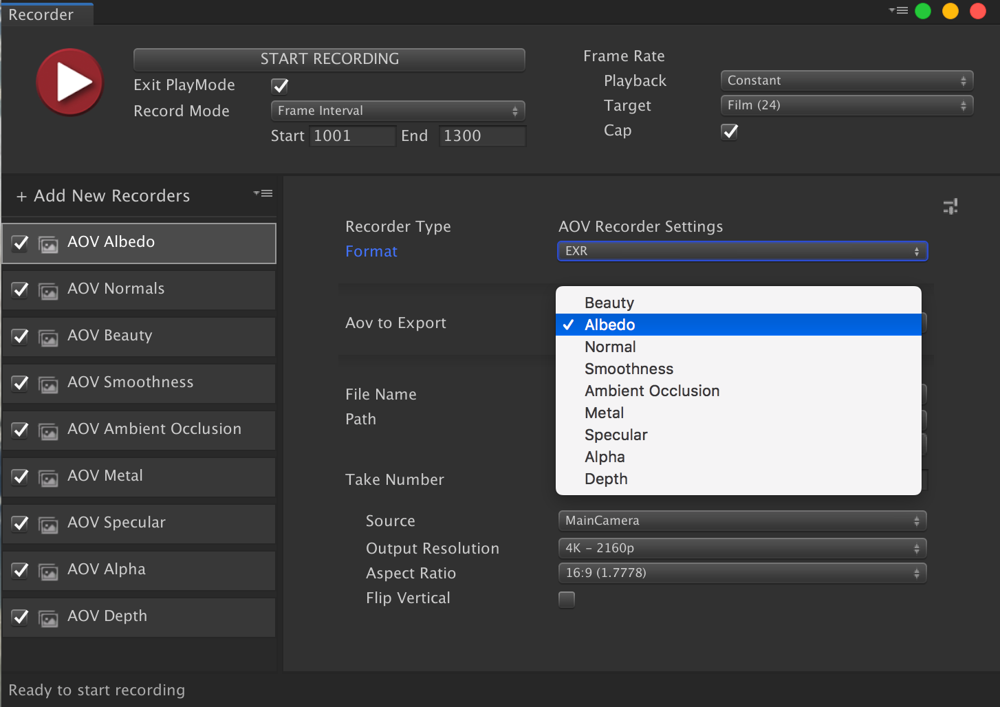
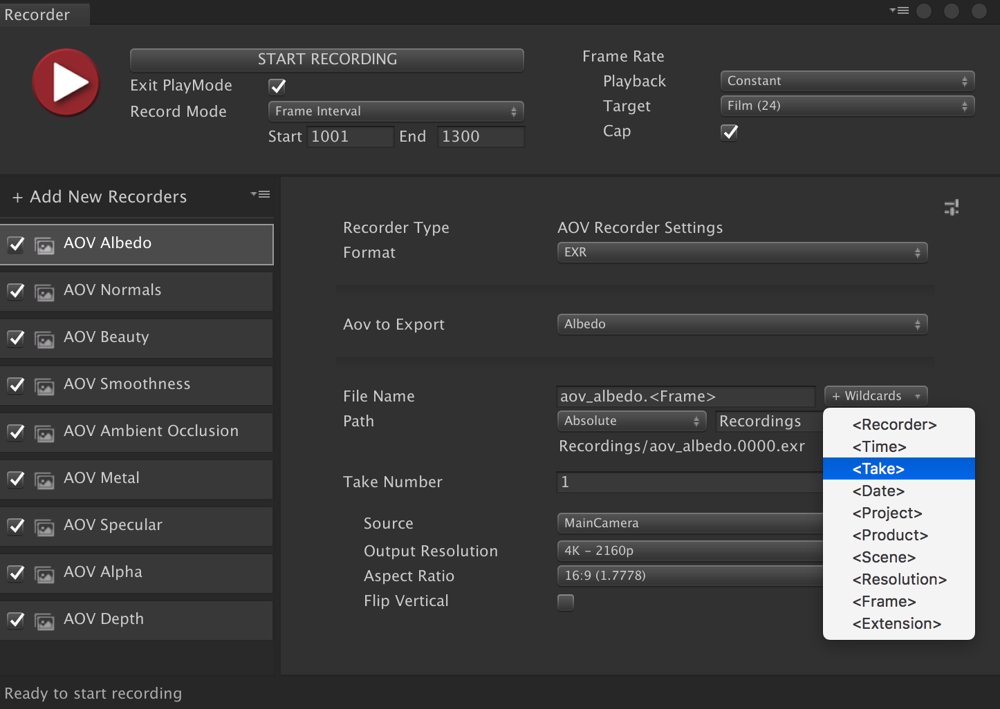
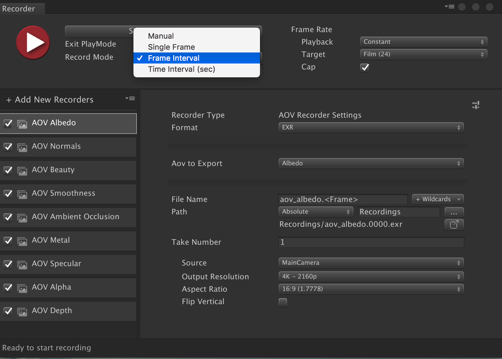

# Unity AOV Recorder V0.1.0 User Manual

The Unity AOV Recorder allows Unity Recorder to record AOV (Arbitrary Output Variables) using High Definition Render Pipeline.

Example: record Normal or Depth render passes to composite them.
Or record an Alpha matte to isolate a part of the rendered image in another DCC tool.

# Installation

To install this package, follow the instructions in the [Package Manager documentation](https://docs.unity3d.com/Packages/com.unity.package-manager-ui@latest/index.html). 

In addition, you need to install the following resources:
 - Unity Recorder 2.0.1 and higher
 - High Definition Render Pipeline version >5.11 for Unity 2019.1 or >6.6 for Unity 2019.2 or greater

# How to use

1. Create an new AOV Image Sequence recorder

2. Select the file format of the AOV Image Sequence

3. Select the AOV to Export

4. Select the pattern of the Image to export, you can add wildcard tags to your filename
 

5. Select the record mode

You can also select the frame rate and playback type.

6. Select the image source   
Only the Main Camera and Tagged Camera are currently supported by the AOV Recorder.

7. Press the Start Recording button to start recording

# Technical details
## Requirements

- Unity Version 2019.1 with HDRP version 5.11 greater
- Unity Version 2019.2 and above with HDRP version 6.6 and greater
- Unity Recorder 2.0.1 and above

This version of AOV Recorder is compatible with the following versions of the Unity Editor:

* 2019.1 and later (2019.2 recommended)

## Known bugs and limitations

The Unity AOV Recorder version 0.1.0 has the following bugs and limitations:

* The Unity AOV Recorder sometimes does not record the first frame.
* The Depth AOV is limited to short distances.
* The Active Camera target is not supported.
* PNG and JPEG files are written as linear instead of sRGB.

## Document revision history
 
|Date|Reason|
|---|---|
|May 30, 2019|Document Create First release of the documentation with version 0.1.0.|
